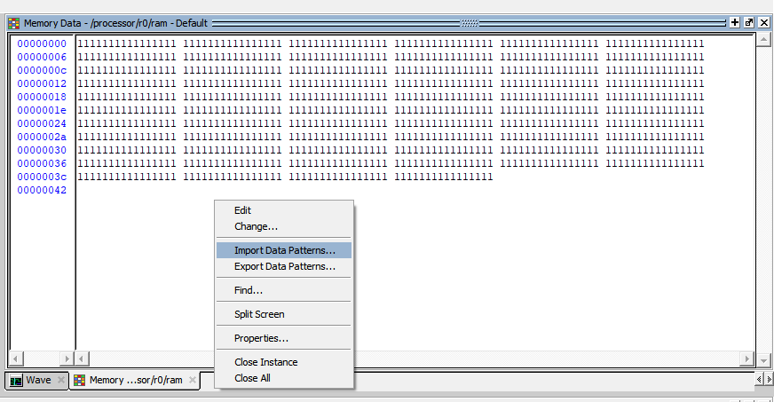

# PDP11-microprocessor

## Introduction

It is a simplified PDP11-based microprocessor that can execute the program loaded in its ram.
 The microprocessor has the following characteristics:

- Word Length: 16 bits
- Memory Size: 4K words
- 32 Instruction
- 8 Addressing modes
    - Register mode “R0”
    - Auto-increment “(R0)+”
    - Auto-decrement “-(R0)”
    - Indexed “X(R0)”
    - Register mode indirect “@R0”
    - Auto-increment indirect “@(R0)+”
    - Auto-decrement indirect “@-(R0)”
    - Indexed indirect “@X(R0)”
- 8 General purpose register (R0, R1, R2, R3, R4, R5, R6, R7)
    - R7 used as PC
	- R6 used as SP
- 4 Special purpose register (IR, MAR, MDR, FLAG)
	- IR: Instruction Register
	- MAR: Memory Address Register
	- MDR: Memory Data Register
	- FLAG: Status Flag Register contains (C, Z, N, P, O)
		- C: Carry Flag
		- Z: Zero Flag (1 if ALU result is 0)
		- N: Negative Flag (1 if ALU result sign is Neg)
		- P: Parity Flag (1 if ALU result is even)
		- O: Overflow Flag (1 if P+P=N or N+N=P or P-N=N or N-P=P)

## Instruction Set

It supports the following instruction set:

- 2 Operand Instructions
	- Syntax “Opcode Src, Dst”
  
		| Instruction           | Operation Performed                                  |
		| --------------------- | ---------------------------------------------------- |
		| MOV                   | Dst ← [Src]                                          |
		| ADD                   | Dst ← [Dst] + [Src]                                  |
		| ADC  (Add with Carry) | Dst ← [Dst] + [Src] + C                              |
		| SUB                   | Dst ← [Dst] – [Src]                                  |
		| SBC  (Sub with Carry) | Dst ← [Dst] – [Src] – C                              |
		| AND                   | Dst ← [Dst] AND [Src]                                |
		| OR                    | Dst ← [Dst] OR [Src]                                 |
		| XNOR                  | Dst ← [Dst] XNOR [Src]                               |
		| CMP (Compare)         | [Dst] – [Src] (Neither of the operands are affected) |

- 1 Operand Instructions
	- Syntax “Opcode Dst”
  
		| Instruction                   | Operation Performed                                            |
		| ----------------------------- | -------------------------------------------------------------- |
		| INC (Increment)               | Dst ← [Dst] + 1                                                |
		| DEC (Decrement)               | Dst ← [Dst] – 1                                                |
		| CLR (Clear)                   | Dst ← 0                                                        |
		| INV (Inverter)                | Dst ← INV([Dst])                                               |
		| LSR (Logic Shift Right)       | Dst ← 0                          & [Dst]  15 - > 1  |
		| ROR (Rotate Right)            | Dst ← [Dst]  0        & [Dst]  15 - > 1  |
		| RRC (Rotate Right with Carry) | Dst ← C                          & [Dst]  15 - > 1  |
		| ASR (Arithmetic Shift Right)  | Dst ← [Dst]  15       & [Dst]  15 - > 1  |
		| LSL (Logic Shift Left)        | Dst ← [Dst]  14 - > 0  & 0                          |
		| ROL (Rotate Left)             | Dst ← [Dst]  14 - > 0  & [Dst]  15       |
		| RLC (Rotate Left with Carry)  | Dst ← [Dst]  14 - > 0  & C                          |

- Branch Instructions
	- Syntax “Opcode Offset”
	- Operation “PC ← PC + Offset” is performed if branch condition is true
  
		| Instruction                    | Branch Condition |
		| ------------------------------ | ---------------- |
		| BR (Branch unconditionally)    | None             |
		| BEQ (Branch if equal)          | Z = 1            |
		| BNE (Branch if not equal)      | Z = 0            |
		| BLO (Branch if Lower)          | C = 0            |
		| BLS (Branch if Lower or same)  | C = 0 or Z = 1   |
		| BHI (Branch if Higher)         | C = 1            |
		| BHS (Branch if Higher or same) | C = 1 or Z = 1   |

- No Operand Instructions
	- Syntax “Opcode”
  
		| Instruction | Operation Performed                                     |
		| ----------- | ------------------------------------------------------- |
		| HLT         | (Halt) Stop the processor                               |
		| NOP         | (No Operation) No operation is performed, Continue code |

- Jump Sub-Routine Instructions

	| Instruction                    | Syntax           | Operation Performed                                                                 |
	| ------------------------------ | ---------------- | ----------------------------------------------------------------------------------- |
	| JSR (Jump to subroutine)       | JSR Address      | SP ← [SP] – 1   [SP] ← [PC]   [PC] ← [Address]                                |
	| RTS (Return from subroutine)   | RTS              | [PC] ← [SP]   SP ← [SP] + 1                                                      |
	| INTERRUPT (Hardware Interrupt) | ---------------- | save flags in stack   save PC in stack   return when interrupt signal is down |

## Assembler

The [assembler](Assembler/assembler.cpp) can deal with the following:
- Variables
	- All variable will be at the end of the file with the following line format “#Value”.  
  	So in the test files “#7” means that at this memory location there is a variable with value=7
	- The variables are signed integers

- Immediate Addressing Mode
	- Immediate addressing mode has the following format “Opcode #0, R”
	- The assembler saves the instruction as “Opcode (R2)+, R”, and saves in the next line “0”.

- Absolute Addressing Mode
	- Absolute addressing mode has the following format “Opcode 0, R”.
	- The assembler should saves the instruction as “Opcode X(R2), R”,  
	and saves in the next line “0-LineNumber”, where “0” is the variable address.

- JSR Addresses
	- JSR has the following format “JSR 0”
	- The assembler saves the instruction as “JSR Opcode”,
	and saves in the next line “0”, where “0” is the sub-routine address.

- Offsets
	- Branch has the following format “Branch 0”
	- The assembler saves the instruction as “BR_Opcode Offset”, where Offset=0.
	- The offset is a signed integer

## Simulation
You can use [ModelSim](https://www.mentor.com/products/fv/modelsim/) in simulation.  
compile using vhdl 2008.   
After compiling, simulate the [processor](processor.vhd) file and import [rows.mem](Test&#32;Programs/Binary&#32;Files/rows.mem) file in the ram.

## Running a program

Here are some test [programs](https://github.com/muhammad-sayed-mahdy/PDP11-microprocessor/tree/master/Test%20Programs/Binary%20Files).  
You can write a new program using the assembler syntax above, then run the [assembler](Assembler/assembler.cpp), 
and the assembler produces a binary file like [this](Test&#32;Programs/Binary&#32;Files/fibo.mem)  
you can then write these binary codes in [rows.mem](Test&#32;Programs/Binary&#32;Files/rows.mem) and import it in the ram in modelsim simulation
